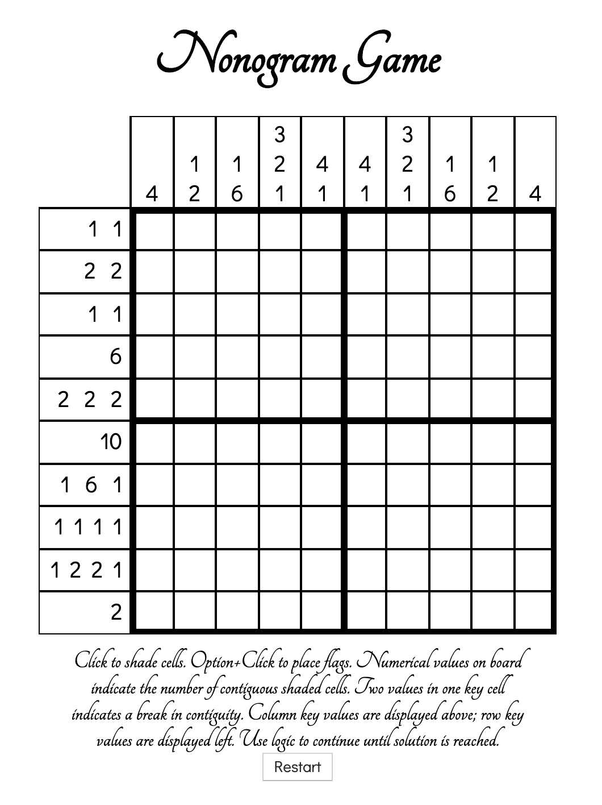

# Nonogram Puzzle
#### Description
*Nonograms were created in 1987 by Japanese designer Non Ishida, when she won a design competition by illuminating specific rooms in a skyscraper to create an image. The resulting paper puzzles Ishida created became popularized in 1990 through their regular inclusion in the British newspaper, "The Sunday Telegraph". Nonograms are also commonly known as Griddlers or Picross. One early example of these puzzles in popular culture was Nintendo's 1995 release of "Mario's Picross" for Game Boy.*

### [Open Puzzle](https://josephcoburn.github.io/nonogram-game/)

#### Technologies Used:
*HTML, CSS, Javascript*

#### Getting Started

*There are a number of strategies you can use to deduce the correct placement of filled-in cells for each row and cell. Read about them 
[here on wikipedia](https://en.wikipedia.org/wiki/Nonogram#Solution_techniques). See the example below for a guide on how to solve a sample nonogram puzzle.*

Focus on one row at a time. Leave tiles blank if uncertain of row solution. You can deduce the row/column solution with certainty based on some key values, but not always. Using red tiles (option+click for mac, alt+click for pc) to mark spaces in solved rows or columns will help with later deductions.

Next focus on each column. Repeat this process until you have found a solution.

#### Next Steps
Future features include:

- Click and drag for faster fill action.
- Add more puzzle boards including different sizes and difficulties.
- Add sounds.
- Add more controls, customizable controls, and controls menu.
- Add 'About' section with my information.
- Add 'About' section to display nonogram history information.
- Add page to link other Japanese puzzles.
- Consider including Google AdSense for monetization.
- Consider including Amazon Affiliate Marketing links to paper versions of popular puzzles including nonograms, sudoku, etc. for monetization.